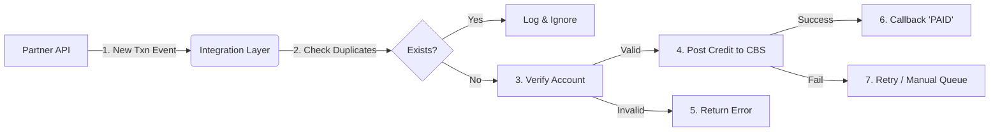

# Remittance Receiving Integration Project

##  Executive Summary

This repository serves as a comprehensive case study of my work as a **Technical Business Analyst** leading the end-to-end integration of a high-volume Remittance Receiving API. This project successfully bridged the gap between a major external Money Transfer Operator (MTO) and our internal Core Banking System (CBS), enabling fully automated, secure, and compliant payouts.

---

## 1. Business Problem

Before this integration, the Operations team managed incoming remittance data through a fragile, manual workflow:
*   **Manual Handling**: Files were manally downloaded from the partner portal and uploaded to the CBS.
*   **Operational Risk**: The manual "download-upload" cycle was prone to human error (e.g., uploading the same file twice, missing files).
*   **Delayed Settlements**: Payouts were only processed during office hours, leading to poor customer experience and partner dissatisfaction.
*   **Compliance Gaps**: Lack of real-time screening checks at the moment of ingestion created potential AML (Anti-Money Laundering) vulnerabilities.

## 2. Business Objectives & Value

The primary goal was to transition from manual batch processing to a **real-time, automated API-driven workflow**.

*   **Automation**: 100% elimination of manual file handling for standard transactions.
*   **Efficiency**: Redistribute **15+ operational hours/week** to higher-value tasks (like exception handling).
*   **Risk Mitigation**: Enforce system-level **idempotency checks** to prevent duplicate payouts (double-spending).
*   **Customer Experience**: Enable **24/7 instant crediting** to beneficiary accounts, improving our competitive position.
*   **Enhanced Compliance**: Integrate real-time sanction screening before any funds are credited.

## 3. My Role (Business Analyst)

I acted as the bridge between the external Partner's technical team and our internal Engineering, Operations, and Compliance units.

*   **Requirements Engineering**: Led workshops to define the "Happy Path" and critical "Exception Paths" (e.g., account closed, limit exceeded).
*   **API Design & Mapping**: Analyzed the Partner's API specifications  and mapped 50+ fields to our internal data models.
*   **Solution Design**: Collaborated with the System Architect to design the "Fetch -> Lock -> Pay" state machine to ensure data integrity.
*   **Quality Assurance**: Defined the User Acceptance Testing (UAT) scope, wrote test cases, and coordinated the UAT sign-off with Finance and Ops.
*   **Documentation**: Created detailed artifacts including Field Mapping Sheets, Sequence Diagrams, and Error Code references.

## 4. Stakeholders & Collaboration

Success required tight alignment across multiple disciplines:

| Stakeholder | Collaboration Focus |
| :--- | :--- |
| **Product Manager** | Defining the roadmap, MVP scope, and go-to-market strategy. |
| **Engineering Team** | Clarifying API logic, error handling behaviors, and retry policies. |
| **Operations Team** | Designing the operational dashboard for monitoring "Stuck/Failed" transactions. |
| **Finance Team** | Ensuring the automated reconciliation reports matched the bank settlements. |
| **Compliance/AML** | Defining the rules strictly for blocking high-risk transactions. |

## 5. Functional & Non-Functional Requirements

### Key Functional Requirements
1.  **Automated Ingestion**: System must poll the Partner API every 60 seconds for new "Ready for Pickup" transactions.
2.  **Idempotency / Deduplication**: System must reject any transaction ID that has already been processed, regardless of status.
3.  **Pre-Validation**: Verify beneficiary account status, currency limits, and AML checks *before* accepting the transaction.


### Key Non-Functional Requirements (NFRs)
*   **Reliability**: Support 99.9% uptime for inquiry and payment APIs.
*   **Security**: All PII (Personally Identifiable Information) must be encrypted at rest and in transit.
*   **Auditability**: Every state change (e.g., `RECEIVED` -> `PROCESSING` -> `PAID`) must be timestamped and logged.
*   **Performance**: Process end-to-end payouts in under 3 seconds per transaction.

## 6. User Stories & Acceptance Criteria

**Story 1: Automated Payout**
> **As a** Finance Manager,
> **I want** valid remittance transactions to be automatically credited to customer accounts,
> **So that** I don't have to manually upload CSV files.
>
> **Acceptance Criteria:**
> *   Transaction with status `READY_FOR_PAYOUT` is fetched by the job.
> *   Beneficiary account is credited with the correct amount.
> *   Transaction status updates to `PAID` in both internal and partner systems.

**Story 2: Duplicate Prevention**
> **As a** Compliance Officer,
> **I want** the system to block any duplicate transaction reference numbers,
> **So that** the bank does not lose money by paying out the same remittance twice.
>
> **Acceptance Criteria:**
> *   If a duplicate `ReferenceID` is received, the system returns strictly defined error `409 Conflict`.
> *   No unexpected debit occurs on the internal ledger.

## 7. Process Flow / System Flow Explanation

The payout logic follows a robust **Retrieve-Lock-Process** pattern to ensure data consistency.

1.  **Poll**: The integration service listens for new transactions from the Partner.
2.  **Duplicate Check**: The system checks the internal database. If the ID exists, it stops immediately.
3.  **Account Validation**: It queries the Core Banking System—"Is Account X active? Does it belong to Name Y?"
4.  **Lock Funds**: If valid, it "locks" the transaction locally to prevent other threads from picking it up.
5.  **Execute Credit**: The actual money movement happens in the Core Banking System.
6.  **Confirm**: On success, we send a `CONFIRM` callback to the Partner API, marking the transaction as complete.

> *See [Workflows](./documentation/Process-Flows/Workflows.md) for the detailed sequence.*



## 8. API / Integration Details

I defined the strict strictly typed contracts between our systems.

**Example Payout Request (Inbound):**
```json
POST /api/v1/remittance/payment-request
{
  "partner_txn_id": "RTX-99887766",
  "sending_amount": 100.00,
  "sending_currency": "USD",
  "payout_amount": 13200.50,
  "payout_currency": "NPR",
  "beneficiary": {
    "account_number": "01201200045",
    "account_name": "Anish Ghimire",
    "bank_code": "NBL-001"
  }
}
```

**Example Success Response:**
```json
HTTP/1.1 200 OK
{
  "internal_txn_id": "CBS-112233",
  "status": "PROCESSING",
  "message": "Transaction accepted and queued for credit."
}
```

## 9. Risks, Edge Cases & Mitigations

| Risk Scenario | Mitigation Strategy |
| :--- | :--- |
| **Partner Timeout** | If the Partner API doesn't confirm receipt, our system implements an exponential backoff retry mechanism. |
| **Account Name Mismatch** | Implemented "Fuzzy Logic" matching (80% confidence) with a manual review queue for borderline cases (e.g., "Jon Doe" vs "John Doe"). |
| **System Downtime** | Store-and-forward architecture queues messages during downtime and processes them sequentially upon recovery. |
| **Duplicate Webhooks** | Use the `partner_txn_id` as a unique database constraint. Second attempts are logged as "Duplicate Ignored" but return "Success" to stop partner retries. |

## 10. Success Metrics / KPIs

Post-deployment tracking showed significant improvements:

*   **Operational Savings**: ~15 hours/week saved.
*   **Processing Time**: Reduced from **4-24 hours** (batch) to **<8 seconds** (real-time).
*   **Error Rate**: Data entry errors reduced from **3%** to **0%**.
*   **Volume Capacity**: System successfully stress-tested at **500 TPM (Transactions Per Minute)**.

## 11. Artifacts Produced

The following deliverables were owned and maintained by me throughout the usage of the project:

- **[Business Requirements (BRD)](./documentation/Requirements/Business_Requirements.md)**: The source of truth for scope.
- **[Status State Machine](./documentation/Process-Flows/Status_Transitions.md)**: Rules for valid transaction state changes.
- **[API Field Mappings](./documentation/API/API_Reference.md)**: The "Rosetta Stone" translating Partner fields to Internal fields.
- **[UAT Test Plan](./documentation/Testing/UAT_Plan.md)**: Checklist used for the Go/No-Go decision.

## 12. Key Learnings

1.  **The "Happy Path" is barely 20% of the work.** Designing for failure (network timeouts, insufficient funds, closed accounts) is where the real complexity lies.
2.  **Idempotency is non-negotiable.** In financial APIs, simply "retrying" without a unique key can handle catastrophic duplicate payouts. Understanding this concept was crucial for my discussions with engineers.
3.  **Clear Error Codes save hours.** Generic errors like "System Error" cause confusion. I pushed for granular codes (e.g., `ERR_ACCOUNT_CLOSED`, `ERR_LIMIT_EXCEEDED`) which empowered Ops to solve issues without escalating to Tech.

---

