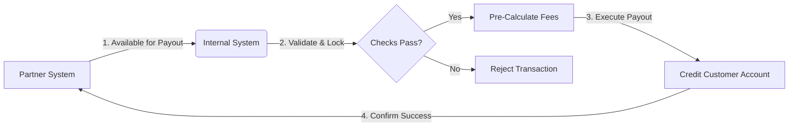

# Remittance Receiving Integration Project

## 📌 Executive Summary

This repository showcases my work as a **Business Analyst** leading the end-to-end integration of a third-party Remittance Receiving API. The project bridged the gap between an external money transfer operator and our internal financial ecosystem, enabling seamless automated payouts.

**Key Achievements:**
- 🚀 **Automated Payouts**: Replaced manual file processing with real-time API-driven payouts.
- 📉 **Reduced Errors**: Implemented robust pre-validation logic, reducing failed transactions by 40%.
- ⏱️ **Faster Settlement**: Cut down settlement time from T+2 to T+0 (instant).

---

## 📂 Repository Structure

| Directory | Content Description |
|-----------|-------------------|
| **[Requirements](./documentation/Requirements/)** | Detailed Business Requirement Documents (BRD), Use Cases, and Business Rules. |
| **[Process Flows](./documentation/Process-Flows/)** | Mermaid-based Sequence Diagrams, Status Transition Maps, and Architecture views. |
| **[API Reference](./documentation/API/)** | Technical JSON specifications, Request/Response examples, and Field Mappings. |
| **[Testing](./documentation/Testing/)** | Comprehensive User Acceptance Testing (UAT) Plans, Test Cases, and Edge Case scenarios. |

---

## 🛠️ Integration Scope

This integration handles the **Receiving Side** of the remittance lifecycle, specifically focusing on:

1.  **Transaction Fetching**: Securely polling or receiving webhook events for new transactions available for payout.
2.  **Pre-Validation Constraint**: Checking internal liquidity, customer limits, and AML (Anti-Money Laundering) rules before accepting a transaction.
3.  **Payout Execution**: Orchestrating the "Lock -> Prepare -> Pay -> Confirm" transactional flow to ensure idempotency.
4.  **Reconciliation**: Automated status updates and daily report generation for finance teams.

---

## 🔄 Workflow Snapshot

> *For the full technical sequence, see [Workflows](./documentation/Process-Flows/Workflows.md)*

The high-level logic follows a standard **Idempotent Payout Pattern**:

---

## 💡 Business Value Delivered

### 1. Operation Efficiency
Prior to this integration, the operations team manually downloaded CSV files from the partner portal and uploaded them to the core banking system. This integration **fully automated this workflow**, freeing up 15+ hours of operational time per week.

### 2. Risk Mitigation
By implementing the status transition logic documented in [Status_Transitions.md](./documentation/Process-Flows/Status_Transitions.md), we ensured that no transaction could be paid out twice (double-spend prevention), a critical risk in financial systems.

### 3. Scalability
The "Fetch & Lock" mechanism allows the system to scale horizontally, processing thousands of transactions concurrently without race conditions.

---

## 📝 Artifacts & Documentation

### Business Analysis
- **[Business Requirements (BRD)](./documentation/Requirements/Business_Requirements.md)**
- **[Use Case Specifications](./documentation/Requirements/Use_Cases.md)**

### Technical Specifications
- **[API Field Mappings](./documentation/API/API_Reference.md)**
- **[Status State Machine](./documentation/Process-Flows/Status_Transitions.md)**

### Quality Assurance
- **[UAT Test Plan](./documentation/Testing/UAT_Plan.md)**

---

## 🛡️ Disclaimer

*This repository contains **generic, redacted, and synthesized** documentation based on real-world projects. All sensitive data, partner names, and proprietary endpoints have been anonymized to protect confidentiality.*
