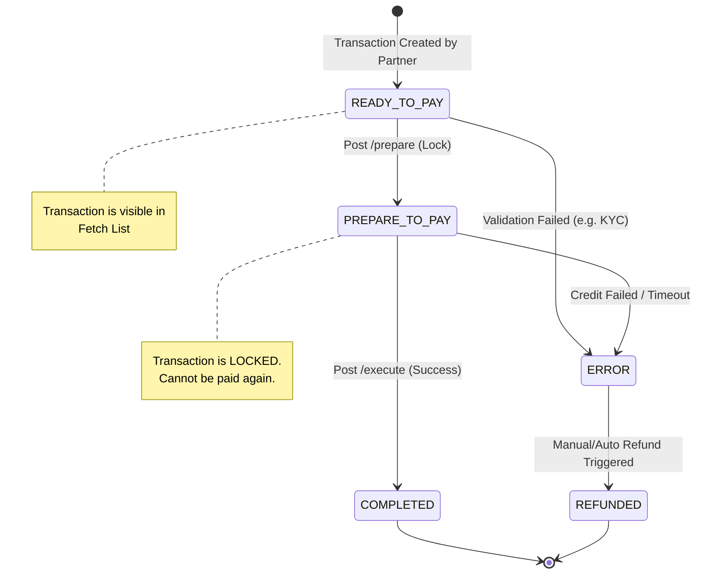

# Transaction Status Lifecycle

This state machine defines the valid transitions for a remittance transaction.

```mermaid
stateDiagram-v2
    [*] --> READY_TO_PAY: Transaction Created by Partner
    
    READY_TO_PAY --> PREPARE_TO_PAY: Post /prepare (Lock)
    READY_TO_PAY --> ERROR: Validation Failed (e.g. KYC)
    
    PREPARE_TO_PAY --> COMPLETED: Post /execute (Success)
    PREPARE_TO_PAY --> ERROR: Credit Failed / Timeout
    
    ERROR --> REFUNDED: Manual/Auto Refund Triggered
    
    COMPLETED --> [*]
    REFUNDED --> [*]
    
    note right of READY_TO_PAY
        Transaction is visible in
        Fetch List
    end note
    
    note right of PREPARE_TO_PAY
        Transaction is LOCKED.
        Cannot be paid again.
    end note
```
