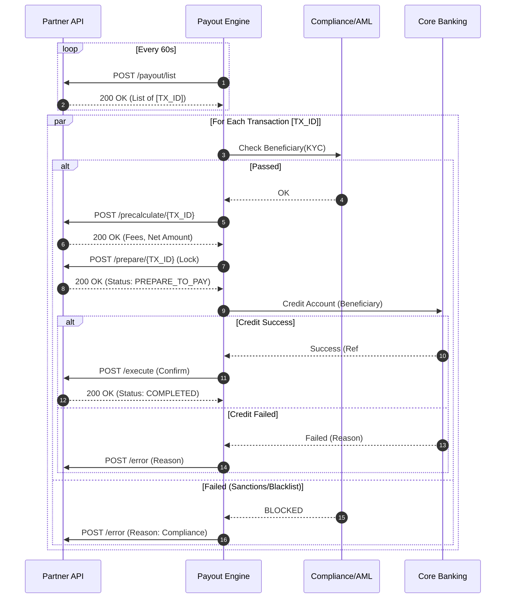

# Process Workflows

## 1. End-to-End Payout Sequence

This sequence diagram illustrates the "Fetch-Lock-Pay" pattern used to ensure safe and idempotent payouts.

```mermaid
sequenceDiagram
    autonumber
    participant Partner as Partner API
    participant Internal as Payout Engine
    participant Compliance as Compliance/AML
    participant Core as Core Banking

    loop Every 60s
        Internal->>Partner: POST /payout/list
        Partner-->>Internal: 200 OK (List of [TX_ID])
    end

    par For Each Transaction [TX_ID]
        Internal->>Compliance: Check Beneficiary(KYC)
        alt Passed
            Compliance-->>Internal: OK
            Internal->>Partner: POST /precalculate/{TX_ID}
            Partner-->>Internal: 200 OK (Fees, Net Amount)
            
            Internal->>Partner: POST /prepare/{TX_ID} (Lock)
            Partner-->>Internal: 200 OK (Status: PREPARE_TO_PAY)

            Internal->>Core: Credit Account (Beneficiary)
            
            alt Credit Success
                Core-->>Internal: Success (Ref #)
                Internal->>Partner: POST /execute (Confirm)
                Partner-->>Internal: 200 OK (Status: COMPLETED)
            else Credit Failed
                Core-->>Internal: Failed (Reason)
                Internal->>Partner: POST /error (Reason)
            end
            
        else Failed (Sanctions/Blacklist)
            Compliance-->>Internal: BLOCKED
            Internal->>Partner: POST /error (Reason: Compliance)
        end
    end
```
